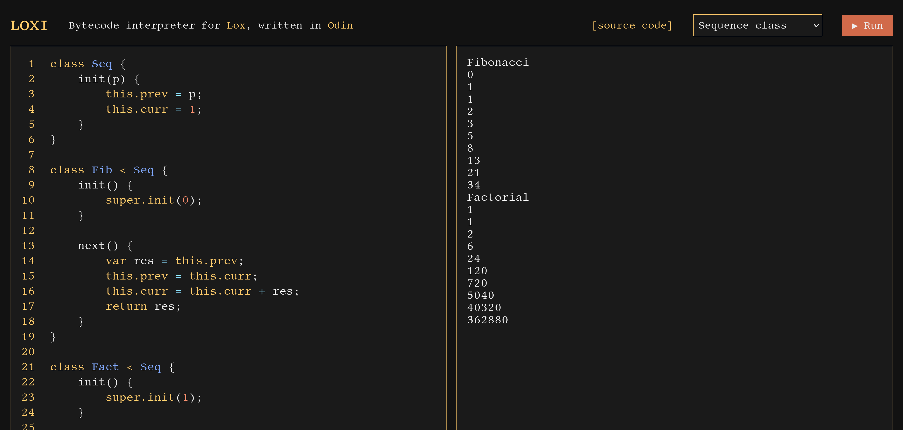
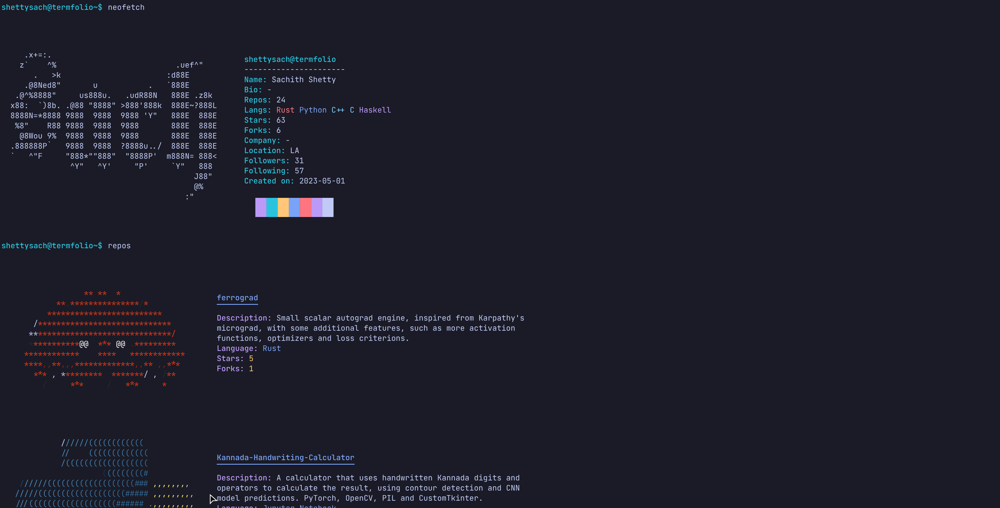

# Projects

These are some of my personal projects.

---

## Loxi

[GitHub](https://github.com/shettysach/loxi),
[Wasm playground](https://shettysach.github.io/Loxi)

- Bytecode interpreter for [the Lox language](https://craftinginterpreters.com/the-lox-language.html) with a mark and sweep garbage collector, based on the second half of [Crafting Interpreters by Robert Nystorm](https://craftinginterpreters.com/)
- Extend Lox with first-class lists and native functions for native functions for list operations

### Languages

- Odin

---

## ferrograd

[GitHub](https://github.com/shettysach/ferrograd)

<pre class="ascii">
   ___                               _
  |  _|___ ___ ___ ___ ___ ___ ___ _| |
  |  _| -_|  _|  _| . | . |  _| .'| . |
  |_| |___|_| |_| |___|_  |_| |__,|___|
                      |___|
</pre>

- A small scalar autograd engine / Rust library, inspired by Karpathy's `micrograd`, with more features such as implementations of extra activation functions, optimizers, loss criterions, and accuracy metrics
- Capable of MNIST classification with an example implemented using the library
- Capable of creating neurons, dense layers, and multilayer perceptrons (MLPs) for binary and multiclass/multilabel non-linear classification

### Features

- Optimizers:
  Adam, RMSprop, SGD with momentum
- Loss criterions:
  Binary Cross-Entropy, Cross-Entropy, Hinge, MSE/RMSE
- Activation functions:
  ReLU, LeakyReLU, sigmoid, tanh

### Languages

- Rust

---

## Kannada Handwriting Calculator

[GitHub](https://github.com/shettysach/Kannada-Handwriting-Calculator)

- A calculator that uses handwritten Kannada digits and operators to calculate the result, using contour detection and CNN/ConvNet/Convolutional Neural Network model prediction
- PyTorch is used to create, train and load the state of the neural network model used for predictions
- The CNN is trained on Kannada MNIST
- OpenCV and Pillow (PIL) are used to read input from the GUI canvas and to obtain contours for individual digits/operators
- CustomTKinter is used to provide the GUI
- The individual digits/operators are detected and their most probable target classes are predicted
- The predictions are combined into a string and evaluated to get the result

### Languages

- Python

### Modules

- pytorch, torchvision
- opencv
- numpy, pandas
- customtkinter

### Tools

- conda, jupyter

---

## CandleMist

[GitHub](https://github.com/shettysach/CandleMist)

<pre class="ascii">
                     (
                     )\
   ___              ((_)    __  __ _    _
  / __|__ _ _ _  __| | |___|  \/  (_)__| |_
 | (__/ _` | ' \/ _` | / -_) |\/| | (_-<  _|
  \___\__,_|_||_\__,_|_\___|_|  |_|_/__/\__|
</pre>

- A fullstack chatbot built using Rust for both the frontend and the backend
- Utilizes quantized Mistral 7B Instruct v0.1 GGUF models
- Built with Hugging Face's Candle framework, which includes the `candle_transformers` crate for LLM inferencing
- Employs Tokio and Actix for asynchronous functionality in the backend, alongside Leptos and TailwindCSS for the frontend

### Languages

- Rust
- TailwindCSS

### Crates and frameworks

- candle-core, candle-transformers
- tokio, actix
- leptos, tailwind

---

## veNum

[GitHub](https://github.com/shettysach/veNum)

<pre class="ascii">
               __
__   _____  /\ \ \_   _ _ __ ___
\ \ / / _ \/  \/ / | | | '_ ` _ \
 \ V /  __/ /\  /| |_| | | | | | |
  \_/ \___\_\ \/  \__,_|_| |_| |_|
</pre>

- Stands for vectorized N-dimensional numerical arrays
- Tensor/ ndarray library

### Features

- Broadcasted algebraic operations
- nd matrix multiplication (naive)
- 1d and 2d convolution/cross-correlation (naive) with strides
- Reduce operations such as sum, product, max, min and pooling
- Transformations such as view/reshape, permute/transpose, flip, expand, pad, slice, squeeze, unsqueeze

### Languages

- Rust

---

## Termfolio

[GitHub](https://github.com/shettysach/Termfolio),
[Page](https://shettysach.github.io/Termfolio)

- Terminal style portfolio website, built using the Leptos framework for Rust WASM
- Customizable and configurable using JSON

### Languages

- Rust
- HTML, CSS

### Crates

- leptos, leptos-use
- tokio, reqwest

---

## Cohle

[GitHub](https://github.com/shettysach/Cohle)

- Rust CLI that prints Rust Cohle quotes

### Languages

- Haskell

---

## Liquid-Oxygen

[GitHub](https://github.com/shettysach/Liquid-Oxygen)

<pre class="ascii">
_    _ ____ _  _ _ ___     ____ _  _ _   _ ____ ____ _  _ 
|    | |  | |  | | |  \ __ |  |  \/   \_/  | __ |___ |\ | 
|___ | |_\| |__| | |__/    |__| _/\_   |   |__] |___ | \| 
                                                          
</pre>

- Tree-walk interpreter for [the Lox language](https://craftinginterpreters.com/the-lox-language.html), based on the first half of [Crafting Interpreters by Robert Nystorm](https://craftinginterpreters.com/)

### Languages

- Haskell
